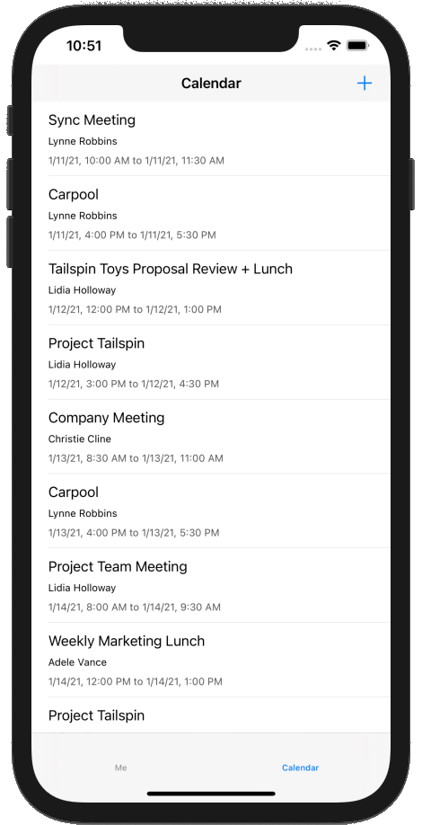

<!-- markdownlint-disable MD002 MD041 -->

В этом упражнении вы добавите Microsoft Graph в приложение. Для этого приложения вы будете использовать [пакет SDK Microsoft Graph для задания](https://github.com/microsoftgraph/msgraph-sdk-objc) с, чтобы совершать вызовы в Microsoft Graph.

## <a name="get-calendar-events-from-outlook"></a>Получение событий календаря из Outlook

В этом разделе описывается расширение `GraphManager` класса для добавления функции, позволяющей получить события и обновление `CalendarViewController` , чтобы использовать эти новые функции.

1. Откройте **графманажер. h** и добавьте приведенный ниже код перед `@interface` объявлением.

    ```objc
    typedef void (^GetEventsCompletionBlock)(NSData* _Nullable data, NSError* _Nullable error);
    ```

1. Добавьте следующий код в `@interface` объявление.

    ```objc
    - (void) getEventsWithCompletionBlock: (GetEventsCompletionBlock)completionBlock;
    ```

1. Откройте **графманажер. m** и добавьте указанную ниже функцию в `GraphManager` класс.

    ```objc
    - (void) getEventsWithCompletionBlock:(GetEventsCompletionBlock)completionBlock {
        // GET /me/events?$select='subject,organizer,start,end'$orderby=createdDateTime DESC
        NSString* eventsUrlString =
        [NSString stringWithFormat:@"%@/me/events?%@&%@",
         MSGraphBaseURL,
         // Only return these fields in results
         @"$select=subject,organizer,start,end",
         // Sort results by when they were created, newest first
         @"$orderby=createdDateTime+DESC"];

        NSURL* eventsUrl = [[NSURL alloc] initWithString:eventsUrlString];
        NSMutableURLRequest* eventsRequest = [[NSMutableURLRequest alloc] initWithURL:eventsUrl];

        MSURLSessionDataTask* eventsDataTask =
        [[MSURLSessionDataTask alloc]
         initWithRequest:eventsRequest
         client:self.graphClient
         completion:^(NSData *data, NSURLResponse *response, NSError *error) {
             if (error) {
                 completionBlock(nil, error);
                 return;
             }

             // TEMPORARY
             completionBlock(data, nil);
         }];

        // Execute the request
        [eventsDataTask execute];
    }
    ```

    > [!NOTE]
    > Рассмотрите, какие действия `getEventsWithCompletionBlock` выполняет код.
    >
    > - URL-адрес, который будет вызываться — это `/v1.0/me/events`.
    > - Параметр `select` запроса позволяет ограничить поля, возвращаемые для каждого события, только теми, которые будут использоваться приложением.
    > - Параметр `orderby` запроса сортирует результаты по дате и времени создания, начиная с самого последнего элемента.

1. Откройте **календарвиевконтроллер. m** и замените все его содержимое приведенным ниже кодом.

    ```objc
    #import "CalendarViewController.h"
    #import "SpinnerViewController.h"
    #import "GraphManager.h"
    #import <MSGraphClientModels/MSGraphClientModels.h>

    @interface CalendarViewController ()

    @property SpinnerViewController* spinner;

    @end

    @implementation CalendarViewController

    - (void)viewDidLoad {
        [super viewDidLoad];
        // Do any additional setup after loading the view.

        self.spinner = [SpinnerViewController alloc];
        [self.spinner startWithContainer:self];

        [GraphManager.instance
         getEventsWithCompletionBlock:^(NSData * _Nullable data, NSError * _Nullable error) {
             dispatch_async(dispatch_get_main_queue(), ^{
                 [self.spinner stop];

                 if (error) {
                     // Show the error
                     UIAlertController* alert = [UIAlertController
                                                 alertControllerWithTitle:@"Error getting events"
                                                 message:error.debugDescription
                                                 preferredStyle:UIAlertControllerStyleAlert];

                     UIAlertAction* okButton = [UIAlertAction
                                                actionWithTitle:@"OK"
                                                style:UIAlertActionStyleDefault
                                                handler:nil];

                     [alert addAction:okButton];
                     [self presentViewController:alert animated:true completion:nil];
                     return;
                 }

                 // TEMPORARY
                 self.calendarJSON.text = [[NSString alloc] initWithData:data encoding:NSUTF8StringEncoding];
                 [self.calendarJSON sizeToFit];
             });
         }];
    }

    @end
    ```

Теперь вы можете запустить приложение, войти и нажать в меню элемент Навигация по **календарю** . В приложении должен появиться дамп JSON событий.

## <a name="display-the-results"></a>Отображение результатов

Теперь вы можете заменить дамп JSON на какой-то способ отобразить результаты в удобном для пользователя виде. В этом разделе будет изменена `getEventsWithCompletionBlock` функция, возвращающая строго типизированные объекты, и изменено `CalendarViewController` , чтобы использовать представление таблицы для отображения событий.

### <a name="update-getevents"></a>Обновление событий

1. Откройте **графманажер. h**. Измените определение `GetEventsCompletionBlock` типа на следующее:

    ```objc
    typedef void (^GetEventsCompletionBlock)(NSArray<MSGraphEvent*>* _Nullable events, NSError* _Nullable error);
    ```

1. Откройте **графманажер. m**. Замените `completionBlock(data, nil);` строку в `getEventsWithCompletionBlock` функции указанным ниже кодом.

    ```objc
    NSError* graphError;

    // Deserialize to an events collection
    MSCollection* eventsCollection = [[MSCollection alloc] initWithData:data error:&graphError];
    if (graphError) {
        completionBlock(nil, graphError);
        return;
    }

    // Create an array to return
    NSMutableArray* eventsArray = [[NSMutableArray alloc]
                                initWithCapacity:eventsCollection.value.count];

    for (id event in eventsCollection.value) {
        // Deserialize the event and add to the array
        MSGraphEvent* graphEvent = [[MSGraphEvent alloc] initWithDictionary:event];
        [eventsArray addObject:graphEvent];
    }

    completionBlock(eventsArray, nil);
    ```

### <a name="update-calendarviewcontroller"></a>Обновление Календарвиевконтроллер

1. Создайте новый файл **класса Touch Cocoa** в проекте **графтуториал** с именем `CalendarTableViewCell`. Выберите **уитаблевиевцелл** в **подклассе** поля.
1. Откройте **календартаблевиевцелл. h** и замените его содержимое приведенным ниже кодом.

    ```objc
    #import <UIKit/UIKit.h>

    NS_ASSUME_NONNULL_BEGIN

    @interface CalendarTableViewCell : UITableViewCell

    @property (nonatomic) NSString* subject;
    @property (nonatomic) NSString* organizer;
    @property (nonatomic) NSString* duration;

    @end

    NS_ASSUME_NONNULL_END
    ```

1. Откройте **календартаблевиевцелл. m** и замените его содержимое приведенным ниже кодом.

    ```objc
    #import "CalendarTableViewCell.h"

    @interface CalendarTableViewCell()

    @property (nonatomic) IBOutlet UILabel *subjectLabel;
    @property (nonatomic) IBOutlet UILabel *organizerLabel;
    @property (nonatomic) IBOutlet UILabel *durationLabel;

    @end

    @implementation CalendarTableViewCell

    - (void)awakeFromNib {
        [super awakeFromNib];
        // Initialization code
    }

    - (void)setSelected:(BOOL)selected animated:(BOOL)animated {
        [super setSelected:selected animated:animated];

        // Configure the view for the selected state
    }

    - (void) setSubject:(NSString *)subject {
        _subject = subject;
        self.subjectLabel.text = subject;
        [self.subjectLabel sizeToFit];
    }

    - (void) setOrganizer:(NSString *)organizer {
        _organizer = organizer;
        self.organizerLabel.text = organizer;
        [self.organizerLabel sizeToFit];
    }

    - (void) setDuration:(NSString *)duration {
        _duration = duration;
        self.durationLabel.text = duration;
        [self.durationLabel sizeToFit];
    }

    @end
    ```

1. Откройте файл **Main. Storyboard** и перейдите к **сцене календаря**. Выберите **представление** в **сцене календаря** и удалите его.

    

1. Добавьте **представление таблицы** из **библиотеки** в **сцену в календаре**.
1. Выберите представление таблицы, а затем выберите **инспектор атрибутов**. Задайте для **ячеек прототипа** значение **1**.
1. Используйте **библиотеку** , чтобы добавить три **метки** к ячейке прототипа.
1. Выберите ячейку прототип, а затем выберите **инспектор удостоверений**. Замените **Class** на **календартаблевиевцелл**.
1. Выберите **инспектор атрибутов** и **идентификатор** набора `EventCell`.
1. В меню **Редактор** выберите команду **устранить проблемы с автоматическим макетом**, а затем выберите **добавить недостающие ограничения** **в все представления на контроллере приветствия**.
1. Выбрав **евентцелл** , выберите **инспектор подключений** и подключение `durationLabel`, `organizerLabel`а `subjectLabel` также метки, добавленные в ячейку в раскадровке.

    

1. Откройте **календарвиевконтроллер. h** и удалите `calendarJSON` свойство.
1. Измените `@interface` объявление на следующее.

    ```objc
    @interface CalendarViewController : UITableViewController
    ```

1. Откройте **календарвиевконтроллер. m** и замените его содержимое приведенным ниже кодом.

    ```objc
    #import "WelcomeViewController.h"
    #import "SpinnerViewController.h"
    #import "AuthenticationManager.h"
    #import "GraphManager.h"
    #import <MSGraphClientModels/MSGraphClientModels.h>

    @interface WelcomeViewController ()

    @property SpinnerViewController* spinner;

    @end

    @implementation WelcomeViewController

    - (void)viewDidLoad {
        [super viewDidLoad];
        // Do any additional setup after loading the view.

        self.spinner = [SpinnerViewController alloc];
        [self.spinner startWithContainer:self];

        self.userProfilePhoto.image = [UIImage imageNamed:@"DefaultUserPhoto"];

        [GraphManager.instance
         getMeWithCompletionBlock:^(MSGraphUser * _Nullable user, NSError * _Nullable error) {
            dispatch_async(dispatch_get_main_queue(), ^{
                [self.spinner stop];

                if (error) {
                    // Show the error
                    UIAlertController* alert = [UIAlertController
                                                alertControllerWithTitle:@"Error getting user profile"
                                                message:error.debugDescription
                                                preferredStyle:UIAlertControllerStyleAlert];

                    UIAlertAction* okButton = [UIAlertAction
                                               actionWithTitle:@"OK"
                                               style:UIAlertActionStyleDefault
                                               handler:nil];

                    [alert addAction:okButton];
                    [self presentViewController:alert animated:true completion:nil];
                    return;
                }

                // Set display name
                self.userDisplayName.text = user.displayName ? : @"Mysterious Stranger";
                [self.userDisplayName sizeToFit];

                // AAD users have email in the mail attribute
                // Personal accounts have email in the userPrincipalName attribute
                self.userEmail.text = user.mail ? : user.userPrincipalName;
                [self.userEmail sizeToFit];
            });
         }];
    }

    - (IBAction)signOut {
        [AuthenticationManager.instance signOut];
        [self performSegueWithIdentifier: @"userSignedOut" sender: nil];
    }

    @end
    ```

1. Запустите приложение и войдите в систему, а затем коснитесь вкладки **Календарь** . Вы должны увидеть список событий.

    
