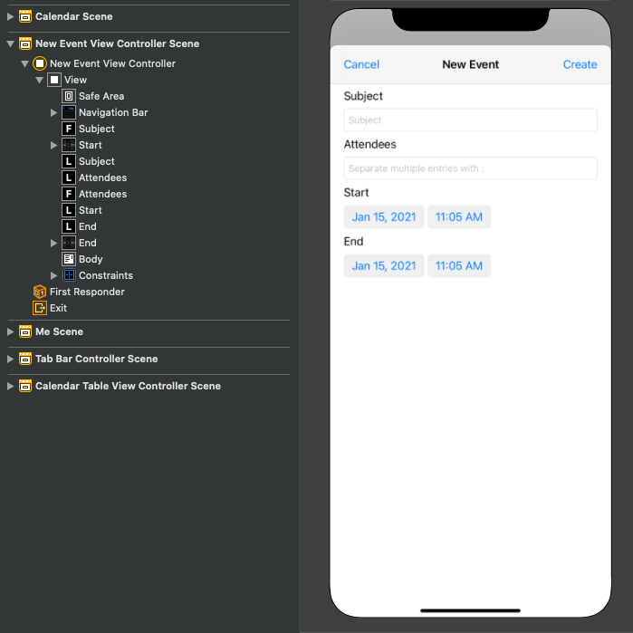

<!-- markdownlint-disable MD002 MD041 -->

<span data-ttu-id="2931c-101">В этом разделе вы добавим возможность создания событий в календаре пользователя.</span><span class="sxs-lookup"><span data-stu-id="2931c-101">In this section you will add the ability to create events on the user's calendar.</span></span>

1. <span data-ttu-id="2931c-102">Откройте **GraphManager.h** и добавьте следующий код над `@interface` объявлением.</span><span class="sxs-lookup"><span data-stu-id="2931c-102">Open **GraphManager.h** and add the following code above the `@interface` declaration.</span></span>

    ```objc
    typedef void (^CreateEventCompletionBlock)(MSGraphEvent* _Nullable event,
                                               NSError* _Nullable error);
    ```

1. <span data-ttu-id="2931c-103">Добавьте в объявление следующий `@interface` код.</span><span class="sxs-lookup"><span data-stu-id="2931c-103">Add the following code to the `@interface` declaration.</span></span>

    ```objc
    - (void) createEventWithSubject: (NSString*) subject
                           andStart: (NSDate*) start
                             andEnd: (NSDate*) end
                       andAttendees: (NSArray<NSString*>* _Nullable) attendees
                            andBody: (NSString* _Nullable) body
                 andCompletionBlock: (CreateEventCompletionBlock) completion;
    ```

1. <span data-ttu-id="2931c-104">Откройте **GraphManager.m** и добавьте следующую функцию для создания нового события в календаре пользователя.</span><span class="sxs-lookup"><span data-stu-id="2931c-104">Open **GraphManager.m** and add the following function to create a new event on the user's calendar.</span></span>

    :::code language="objc" source="../demo/GraphTutorial/GraphTutorial/GraphManager.m" id="CreateEventSnippet":::

1. <span data-ttu-id="2931c-105">Создайте файл **класса Cocoa Touch в** папке **GraphTutorial** с именем `NewEventViewController` .</span><span class="sxs-lookup"><span data-stu-id="2931c-105">Create a new **Cocoa Touch Class** file in the **GraphTutorial** folder named `NewEventViewController`.</span></span> <span data-ttu-id="2931c-106">Выберите **UIViewController** в **подклассе** поля.</span><span class="sxs-lookup"><span data-stu-id="2931c-106">Choose **UIViewController** in the **Subclass of** field.</span></span>
1. <span data-ttu-id="2931c-107">Откройте **NewEventViewController.h** и добавьте следующий код в `@interface` объявление.</span><span class="sxs-lookup"><span data-stu-id="2931c-107">Open **NewEventViewController.h** and add the following code inside the `@interface` declaration.</span></span>

    ```objectivec
    @property (nonatomic) IBOutlet UITextField* subject;
    @property (nonatomic) IBOutlet UITextField* attendees;
    @property (nonatomic) IBOutlet UIDatePicker* start;
    @property (nonatomic) IBOutlet UIDatePicker* end;
    @property (nonatomic) IBOutlet UITextView* body;
    ```

1. <span data-ttu-id="2931c-108">Откройте **NewEventController.m** и замените его содержимое следующим кодом.</span><span class="sxs-lookup"><span data-stu-id="2931c-108">Open **NewEventController.m** and replace its contents with the following code.</span></span>

    :::code language="objc" source="../demo/GraphTutorial/GraphTutorial/NewEventViewController.m" id="NewEventViewControllerSnippet":::

1. <span data-ttu-id="2931c-109">Откройте **main.storyboard.**</span><span class="sxs-lookup"><span data-stu-id="2931c-109">Open **Main.storyboard**.</span></span> <span data-ttu-id="2931c-110">Используйте **библиотеку для** перетаскивания **контроллера представления** в storyboard.</span><span class="sxs-lookup"><span data-stu-id="2931c-110">Use the **Library** to drag a **View Controller** onto the storyboard.</span></span>
1. <span data-ttu-id="2931c-111">С помощью **библиотеки добавьте** на контроллер представления **панели** навигации.</span><span class="sxs-lookup"><span data-stu-id="2931c-111">Using the **Library**, add a **Navigation Bar** to the view controller.</span></span>
1. <span data-ttu-id="2931c-112">Дважды щелкните **заголовок** на панели навигации и обновите его до `New Event` .</span><span class="sxs-lookup"><span data-stu-id="2931c-112">Double-click the **Title** in the navigation bar and update it to `New Event`.</span></span>
1. <span data-ttu-id="2931c-113">С помощью **библиотеки добавьте** элемент кнопки **панели** в левую часть панели навигации.</span><span class="sxs-lookup"><span data-stu-id="2931c-113">Using the **Library**, add a **Bar Button Item** to the left-hand side of the navigation bar.</span></span>
1. <span data-ttu-id="2931c-114">Выберите новую кнопку панели, а затем — **инспектор атрибутов.**</span><span class="sxs-lookup"><span data-stu-id="2931c-114">Select the new bar button, then select the **Attributes Inspector**.</span></span> <span data-ttu-id="2931c-115">Измените **заголовок** на `Cancel` .</span><span class="sxs-lookup"><span data-stu-id="2931c-115">Change **Title** to `Cancel`.</span></span>
1. <span data-ttu-id="2931c-116">С помощью **библиотеки добавьте** элемент кнопки **панели** в правую часть панели навигации.</span><span class="sxs-lookup"><span data-stu-id="2931c-116">Using the **Library**, add a **Bar Button Item** to the right-hand side of the navigation bar.</span></span>
1. <span data-ttu-id="2931c-117">Выберите новую кнопку панели, а затем — **инспектор атрибутов.**</span><span class="sxs-lookup"><span data-stu-id="2931c-117">Select the new bar button, then select the **Attributes Inspector**.</span></span> <span data-ttu-id="2931c-118">Измените **заголовок** на `Create` .</span><span class="sxs-lookup"><span data-stu-id="2931c-118">Change **Title** to `Create`.</span></span>
1. <span data-ttu-id="2931c-119">Выберите контроллер представления, а затем выберите **инспектор удостоверений.**</span><span class="sxs-lookup"><span data-stu-id="2931c-119">Select the view controller, then select the **Identity Inspector**.</span></span> <span data-ttu-id="2931c-120">Измените **класс** **на NewEventViewController.**</span><span class="sxs-lookup"><span data-stu-id="2931c-120">Change **Class** to **NewEventViewController**.</span></span>
1. <span data-ttu-id="2931c-121">Добавьте в представление следующие элементы **управления** из библиотеки.</span><span class="sxs-lookup"><span data-stu-id="2931c-121">Add the following controls from the **Library** to the view.</span></span>

    - <span data-ttu-id="2931c-122">Добавьте **метку** под панели навигации.</span><span class="sxs-lookup"><span data-stu-id="2931c-122">Add a **Label** under the navigation bar.</span></span> <span data-ttu-id="2931c-123">За установите его текст `Subject` .</span><span class="sxs-lookup"><span data-stu-id="2931c-123">Set its text to `Subject`.</span></span>
    - <span data-ttu-id="2931c-124">Добавьте **текстовое поле** под меткой.</span><span class="sxs-lookup"><span data-stu-id="2931c-124">Add a **Text Field** under the label.</span></span> <span data-ttu-id="2931c-125">**Задайте для атрибута Placeholder** задайте его `Subject` ..</span><span class="sxs-lookup"><span data-stu-id="2931c-125">Set its **Placeholder** attribute to `Subject`.</span></span>
    - <span data-ttu-id="2931c-126">Добавьте **метку** под текстовым полем.</span><span class="sxs-lookup"><span data-stu-id="2931c-126">Add a **Label** under the text field.</span></span> <span data-ttu-id="2931c-127">За установите его текст `Attendees` .</span><span class="sxs-lookup"><span data-stu-id="2931c-127">Set its text to `Attendees`.</span></span>
    - <span data-ttu-id="2931c-128">Добавьте **текстовое поле** под меткой.</span><span class="sxs-lookup"><span data-stu-id="2931c-128">Add a **Text Field** under the label.</span></span> <span data-ttu-id="2931c-129">**Задайте для атрибута Placeholder** задайте его `Separate multiple entries with ;` ..</span><span class="sxs-lookup"><span data-stu-id="2931c-129">Set its **Placeholder** attribute to `Separate multiple entries with ;`.</span></span>
    - <span data-ttu-id="2931c-130">Добавьте **метку** под текстовым полем.</span><span class="sxs-lookup"><span data-stu-id="2931c-130">Add a **Label** under the text field.</span></span> <span data-ttu-id="2931c-131">За установите его текст `Start` .</span><span class="sxs-lookup"><span data-stu-id="2931c-131">Set its text to `Start`.</span></span>
    - <span data-ttu-id="2931c-132">Добавьте под **меткой "Выбор** даты".</span><span class="sxs-lookup"><span data-stu-id="2931c-132">Add a **Date Picker** under the label.</span></span> <span data-ttu-id="2931c-133">Установите для **предпочитаемого** стиля **компактный,** **его интервал** **составляет 15** минут, а высоту **35.**</span><span class="sxs-lookup"><span data-stu-id="2931c-133">Set its **Preferred Style** to **Compact**, its **Interval** to **15 minutes**, and its height to **35**.</span></span>
    - <span data-ttu-id="2931c-134">Добавьте **метку** в подстройку "Выбор даты".</span><span class="sxs-lookup"><span data-stu-id="2931c-134">Add a **Label** under the date picker.</span></span> <span data-ttu-id="2931c-135">За установите его текст `End` .</span><span class="sxs-lookup"><span data-stu-id="2931c-135">Set its text to `End`.</span></span>
    - <span data-ttu-id="2931c-136">Добавьте под **меткой "Выбор** даты".</span><span class="sxs-lookup"><span data-stu-id="2931c-136">Add a **Date Picker** under the label.</span></span> <span data-ttu-id="2931c-137">Установите для **предпочитаемого** стиля **компактный,** **его интервал** **составляет 15** минут, а высоту **35.**</span><span class="sxs-lookup"><span data-stu-id="2931c-137">Set its **Preferred Style** to **Compact**, its **Interval** to **15 minutes**, and its height to **35**.</span></span>
    - <span data-ttu-id="2931c-138">Добавьте представление **текста в** подстройке "Выбор даты".</span><span class="sxs-lookup"><span data-stu-id="2931c-138">Add a **Text View** under the date picker.</span></span>

1. <span data-ttu-id="2931c-139">Выберите новый **контроллер представления событий** и используйте connection **Inspector** для подключения к следующим подключениям.</span><span class="sxs-lookup"><span data-stu-id="2931c-139">Select the **New Event View Controller** and use the **Connection Inspector** to make the following connections.</span></span>

    - <span data-ttu-id="2931c-140">Подключите **полученное** действие отмены к **кнопке** "Отмена панели".</span><span class="sxs-lookup"><span data-stu-id="2931c-140">Connect the **cancel** received action to the **Cancel** bar button.</span></span>
    - <span data-ttu-id="2931c-141">Подключите **полученное действие createEvent** к кнопке **"Создать** планку".</span><span class="sxs-lookup"><span data-stu-id="2931c-141">Connect the **createEvent** received action to the **Create** bar button.</span></span>
    - <span data-ttu-id="2931c-142">Подключите **розетку темы** к первому текстовом полю.</span><span class="sxs-lookup"><span data-stu-id="2931c-142">Connect the **subject** outlet to the first text field.</span></span>
    - <span data-ttu-id="2931c-143">Подключите **выход участников** к второму текстовом полю.</span><span class="sxs-lookup"><span data-stu-id="2931c-143">Connect the **attendees** outlet to the second text field.</span></span>
    - <span data-ttu-id="2931c-144">Подключите **точки** начала к первому выбору даты.</span><span class="sxs-lookup"><span data-stu-id="2931c-144">Connect the **start** outlet to the first date picker.</span></span>
    - <span data-ttu-id="2931c-145">Подключите **конечный** выход к второму выбору даты.</span><span class="sxs-lookup"><span data-stu-id="2931c-145">Connect the **end** outlet to the second date picker.</span></span>
    - <span data-ttu-id="2931c-146">Подключите **выходной текст** к текстовом представлению.</span><span class="sxs-lookup"><span data-stu-id="2931c-146">Connect the **body** outlet to the text view.</span></span>

1. <span data-ttu-id="2931c-147">Добавьте следующие ограничения.</span><span class="sxs-lookup"><span data-stu-id="2931c-147">Add the following constraints.</span></span>

    - <span data-ttu-id="2931c-148">**Панель навигации**</span><span class="sxs-lookup"><span data-stu-id="2931c-148">**Navigation Bar**</span></span>
        - <span data-ttu-id="2931c-149">Пробел в безопасную зону, значение: 0</span><span class="sxs-lookup"><span data-stu-id="2931c-149">Leading space to Safe Area, value: 0</span></span>
        - <span data-ttu-id="2931c-150">После пробела в "Безопасная область", значение: 0</span><span class="sxs-lookup"><span data-stu-id="2931c-150">Trailing space to Safe Area, value: 0</span></span>
        - <span data-ttu-id="2931c-151">Верхнее место в безопасной области, значение: 0</span><span class="sxs-lookup"><span data-stu-id="2931c-151">Top space to Safe Area, value: 0</span></span>
        - <span data-ttu-id="2931c-152">Высота, значение: 44</span><span class="sxs-lookup"><span data-stu-id="2931c-152">Height, value: 44</span></span>
    - <span data-ttu-id="2931c-153">**Метка темы**</span><span class="sxs-lookup"><span data-stu-id="2931c-153">**Subject Label**</span></span>
        - <span data-ttu-id="2931c-154">Пробел в поле представления, значение: 0</span><span class="sxs-lookup"><span data-stu-id="2931c-154">Leading space to View margin, value: 0</span></span>
        - <span data-ttu-id="2931c-155">В окн. место в поле просмотра, значение: 0</span><span class="sxs-lookup"><span data-stu-id="2931c-155">Trailing space to View margin, value: 0</span></span>
        - <span data-ttu-id="2931c-156">Верхнее пространство для панели навигации, значение: 20</span><span class="sxs-lookup"><span data-stu-id="2931c-156">Top space to Navigation Bar, value: 20</span></span>
    - <span data-ttu-id="2931c-157">**Поле "Текст темы"**</span><span class="sxs-lookup"><span data-stu-id="2931c-157">**Subject Text Field**</span></span>
        - <span data-ttu-id="2931c-158">Пробел в поле представления, значение: 0</span><span class="sxs-lookup"><span data-stu-id="2931c-158">Leading space to View margin, value: 0</span></span>
        - <span data-ttu-id="2931c-159">В окн. место в поле просмотра, значение: 0</span><span class="sxs-lookup"><span data-stu-id="2931c-159">Trailing space to View margin, value: 0</span></span>
        - <span data-ttu-id="2931c-160">Верхнее пространство для метки субъекта, значение: Стандартный</span><span class="sxs-lookup"><span data-stu-id="2931c-160">Top space to Subject Label, value: Standard</span></span>
    - <span data-ttu-id="2931c-161">**Метка "Участники"**</span><span class="sxs-lookup"><span data-stu-id="2931c-161">**Attendees Label**</span></span>
        - <span data-ttu-id="2931c-162">Пробел в поле представления, значение: 0</span><span class="sxs-lookup"><span data-stu-id="2931c-162">Leading space to View margin, value: 0</span></span>
        - <span data-ttu-id="2931c-163">В окн. место в поле просмотра, значение: 0</span><span class="sxs-lookup"><span data-stu-id="2931c-163">Trailing space to View margin, value: 0</span></span>
        - <span data-ttu-id="2931c-164">Верхнее пространство для текстового поля темы, значение: Стандартный</span><span class="sxs-lookup"><span data-stu-id="2931c-164">Top space to Subject Text Field, value: Standard</span></span>
    - <span data-ttu-id="2931c-165">**Текстовое поле участников**</span><span class="sxs-lookup"><span data-stu-id="2931c-165">**Attendees Text Field**</span></span>
        - <span data-ttu-id="2931c-166">Пробел в поле представления, значение: 0</span><span class="sxs-lookup"><span data-stu-id="2931c-166">Leading space to View margin, value: 0</span></span>
        - <span data-ttu-id="2931c-167">В окн. место в поле просмотра, значение: 0</span><span class="sxs-lookup"><span data-stu-id="2931c-167">Trailing space to View margin, value: 0</span></span>
        - <span data-ttu-id="2931c-168">Top space to Attendees Label, value: Standard</span><span class="sxs-lookup"><span data-stu-id="2931c-168">Top space to Attendees Label, value: Standard</span></span>
    - <span data-ttu-id="2931c-169">**Метка "Начните"**</span><span class="sxs-lookup"><span data-stu-id="2931c-169">**Start Label**</span></span>
        - <span data-ttu-id="2931c-170">Пробел в поле представления, значение: 0</span><span class="sxs-lookup"><span data-stu-id="2931c-170">Leading space to View margin, value: 0</span></span>
        - <span data-ttu-id="2931c-171">В окн. место в поле просмотра, значение: 0</span><span class="sxs-lookup"><span data-stu-id="2931c-171">Trailing space to View margin, value: 0</span></span>
        - <span data-ttu-id="2931c-172">Верхнее пространство для текстового поля темы, значение: Стандартный</span><span class="sxs-lookup"><span data-stu-id="2931c-172">Top space to Subject Text Field, value: Standard</span></span>
    - <span data-ttu-id="2931c-173">**Выбор даты начала**</span><span class="sxs-lookup"><span data-stu-id="2931c-173">**Start Date Picker**</span></span>
        - <span data-ttu-id="2931c-174">Пробел в поле представления, значение: 0</span><span class="sxs-lookup"><span data-stu-id="2931c-174">Leading space to View margin, value: 0</span></span>
        - <span data-ttu-id="2931c-175">В окн. место в поле просмотра, значение: 0</span><span class="sxs-lookup"><span data-stu-id="2931c-175">Trailing space to View margin, value: 0</span></span>
        - <span data-ttu-id="2931c-176">Top space to Attendees Label, value: Standard</span><span class="sxs-lookup"><span data-stu-id="2931c-176">Top space to Attendees Label, value: Standard</span></span>
        - <span data-ttu-id="2931c-177">Высота, значение: 35</span><span class="sxs-lookup"><span data-stu-id="2931c-177">Height, value: 35</span></span>
    - <span data-ttu-id="2931c-178">**End Label**</span><span class="sxs-lookup"><span data-stu-id="2931c-178">**End Label**</span></span>
        - <span data-ttu-id="2931c-179">Пробел в поле представления, значение: 0</span><span class="sxs-lookup"><span data-stu-id="2931c-179">Leading space to View margin, value: 0</span></span>
        - <span data-ttu-id="2931c-180">В окн. место в поле просмотра, значение: 0</span><span class="sxs-lookup"><span data-stu-id="2931c-180">Trailing space to View margin, value: 0</span></span>
        - <span data-ttu-id="2931c-181">Верхнее место для начала выбор даты, значение: Стандартный</span><span class="sxs-lookup"><span data-stu-id="2931c-181">Top space to Start Date Picker, value: Standard</span></span>
    - <span data-ttu-id="2931c-182">**Выбор даты окончания**</span><span class="sxs-lookup"><span data-stu-id="2931c-182">**End Date Picker**</span></span>
        - <span data-ttu-id="2931c-183">Пробел в поле представления, значение: 0</span><span class="sxs-lookup"><span data-stu-id="2931c-183">Leading space to View margin, value: 0</span></span>
        - <span data-ttu-id="2931c-184">В окн. место в поле просмотра, значение: 0</span><span class="sxs-lookup"><span data-stu-id="2931c-184">Trailing space to View margin, value: 0</span></span>
        - <span data-ttu-id="2931c-185">Верхнее место в конце метки, значение: Стандартный</span><span class="sxs-lookup"><span data-stu-id="2931c-185">Top space to End Label, value: Standard</span></span>
        - <span data-ttu-id="2931c-186">Высота: 35</span><span class="sxs-lookup"><span data-stu-id="2931c-186">Height: 35</span></span>
    - <span data-ttu-id="2931c-187">**Представление текста в тексте**</span><span class="sxs-lookup"><span data-stu-id="2931c-187">**Body Text View**</span></span>
        - <span data-ttu-id="2931c-188">Пробел в поле представления, значение: 0</span><span class="sxs-lookup"><span data-stu-id="2931c-188">Leading space to View margin, value: 0</span></span>
        - <span data-ttu-id="2931c-189">В окн. место в поле просмотра, значение: 0</span><span class="sxs-lookup"><span data-stu-id="2931c-189">Trailing space to View margin, value: 0</span></span>
        - <span data-ttu-id="2931c-190">Top space to End Date Picker, value: Standard</span><span class="sxs-lookup"><span data-stu-id="2931c-190">Top space to End Date Picker, value: Standard</span></span>
        - <span data-ttu-id="2931c-191">Нижнее пространство для поля просмотра, значение: 0</span><span class="sxs-lookup"><span data-stu-id="2931c-191">Bottom space to View margin, value: 0</span></span>

    

1. <span data-ttu-id="2931c-193">Выберите **"Сцена календаря",** а затем выберите **"Connections Inspector".**</span><span class="sxs-lookup"><span data-stu-id="2931c-193">Select the **Calendar Scene**, then select the **Connections Inspector**.</span></span>
1. <span data-ttu-id="2931c-194">В **области "Триггерные сеги"** перетащите незаполненный круг рядом с вручную на контроллер представления нового события в storyboard.  </span><span class="sxs-lookup"><span data-stu-id="2931c-194">Under **Triggered Segues**, drag the unfilled circle next to **manual** onto the **New Event View Controller** on the storyboard.</span></span> <span data-ttu-id="2931c-195">Выберите **"Представить" модально** во всплывающее меню.</span><span class="sxs-lookup"><span data-stu-id="2931c-195">Select **Present Modally** in the pop-up menu.</span></span>
1. <span data-ttu-id="2931c-196">Выберите только что добавленную сегу, а затем — **инспектор атрибутов.**</span><span class="sxs-lookup"><span data-stu-id="2931c-196">Select the segue you just added, then select the **Attributes Inspector**.</span></span> <span data-ttu-id="2931c-197">Установите **для поля "Идентификатор" (Identifier)** `showEventForm` (Идентификатор).</span><span class="sxs-lookup"><span data-stu-id="2931c-197">Set the **Identifier** field to `showEventForm`.</span></span>
1. <span data-ttu-id="2931c-198">Подключите **полученное действие showNewEventForm** к кнопке **+** панели навигации.</span><span class="sxs-lookup"><span data-stu-id="2931c-198">Connect the **showNewEventForm** received action to the **+** navigation bar button.</span></span>
1. <span data-ttu-id="2931c-199">Сохраните изменения и перезапустите приложение.</span><span class="sxs-lookup"><span data-stu-id="2931c-199">Save your changes and restart the app.</span></span> <span data-ttu-id="2931c-200">Перейдите на страницу календаря и нажмите **+** кнопку.</span><span class="sxs-lookup"><span data-stu-id="2931c-200">Go to the calendar page and tap the **+** button.</span></span> <span data-ttu-id="2931c-201">Заполните форму и нажмите **кнопку "Создать",** чтобы создать новое событие.</span><span class="sxs-lookup"><span data-stu-id="2931c-201">Fill in the form and tap **Create** to create a new event.</span></span>

    
